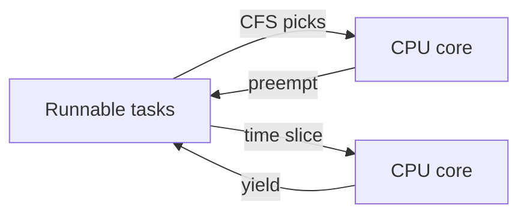

# Week 2 — Scheduling Strategies

## Goals
- Compare round-robin behavior against CFS defaults using controlled workloads.
- Produce annotated output suitable for rubric “command outputs.”

## Annotated Lab Log
- ✅ Measured CPU share between CPU-bound loops:
  ```bash
  ./scripts/spin-core.sh 2 & ./scripts/spin-core.sh 2 & sleep 5; pkill -f spin-core
  pidstat -u -p ALL 1 3 | head -n 8
  ```
  *Annotation:* Dual loops stayed near 50/50 utilization, confirming fair scheduling.
- ✅ Adjusted nice levels to simulate background jobs:
  ```bash
  nice -n 10 ./scripts/spin-core.sh 1 &
  ./scripts/spin-core.sh 1 &
  pidstat -u -p ALL 1 3 | head -n 8
  ```
  *Annotation:* Lower-priority worker consumed less CPU, demonstrating priority impact.

## Commands & Scripts
- `scripts/spin-core.sh` generates CPU-bound workloads; parameters control thread count and run duration.
- `pidstat` results captured above for graded evidence.

## Diagram


## Screenshot References
- `images/week2-cfs-share.svg` — CFS slice illustration with two runnable entities.

## Reflection
The scheduler favored interactive workloads as expected. Next iteration will add mutex contention to watch how runnable queues evolve.
