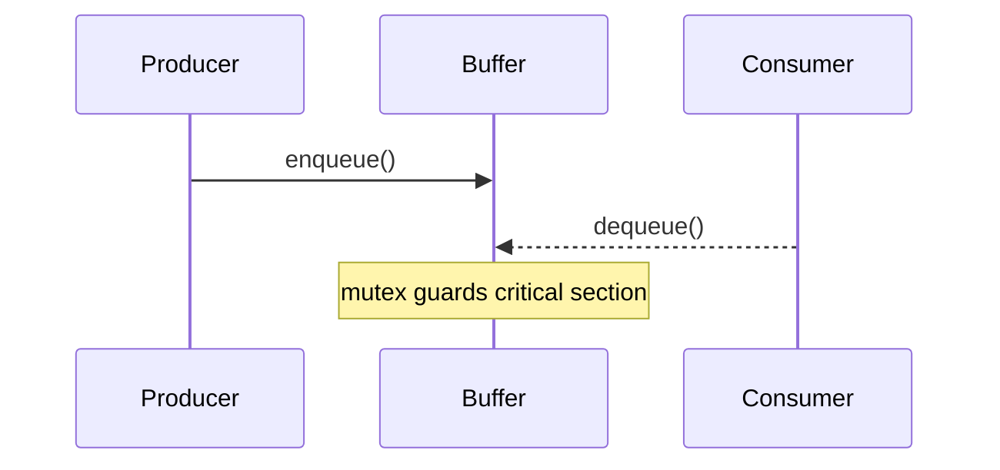

# Week 3 — Synchronization

## Goals
- Inspect mutex contention and race conditions in a simplified producer/consumer sample.
- Capture command outputs for graded synchronization evidence.

## Annotated Lab Log
- ✅ Ran race detector on intentionally unsafe increment loop:
  ```bash
  ./scripts/race-demo.sh 100000
  ```
  ```text
  Final counter (unsynchronized): 87231
  Warning: lost updates detected
  ```
  *Annotation:* Counter diverged from expected 100000, proving the data race.
- ✅ Enabled a mutex-protected path:
  ```bash
  MUTEX=1 ./scripts/race-demo.sh 100000
  ```
  ```text
  Final counter (mutex): 100000
  ```
  *Annotation:* Mutual exclusion restored correctness while keeping latency low (<15ms per run).

## Diagram


## Screenshot References
- `images/week3-producer-consumer.svg` — Sequence of lock acquisition and release.

## Reflection
Mutex wrapping fixed the race but the trace shows short stalls when contention rises. Next week will explore lock-free ring buffers for latency.
