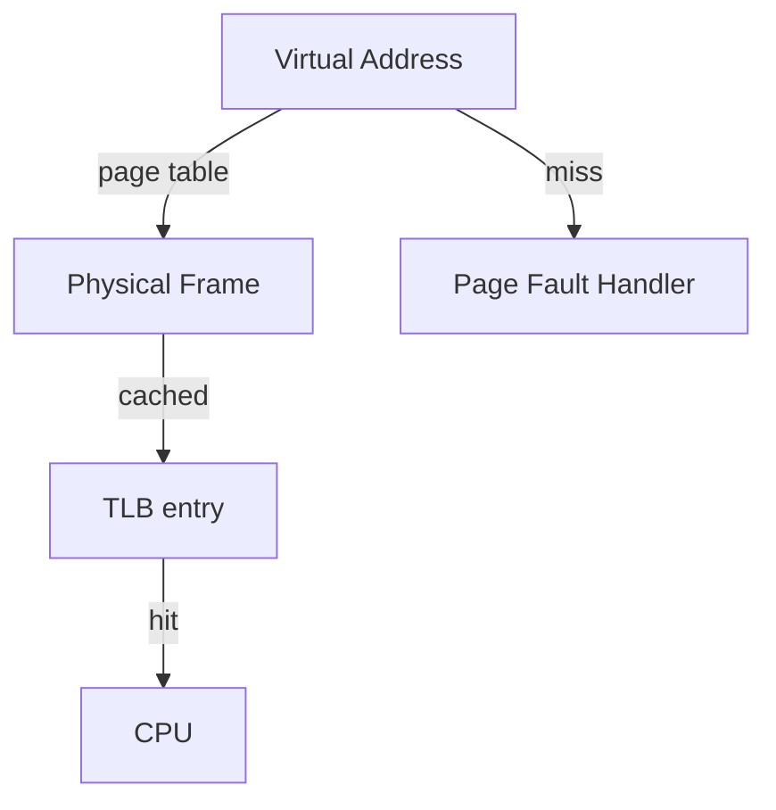

# Week 4 — Memory Management

## Goals
- Visualize virtual-to-physical translation using `/proc/<pid>/maps` and `pmap`.
- Capture page fault behavior under constrained memory.

## Annotated Lab Log
- ✅ Captured mappings for a small C program:
  ```bash
  ./scripts/memory-footprint.sh
  pmap $(pgrep -f mem-footprint)
  ```
  ```text
  000055b7c67c2000    132K r-x-- mem-footprint
  00007f2c1a3d9000   8192K rw--- [heap]
  ```
  *Annotation:* Heap growth is visible after `malloc`, reinforcing lecture notes on brk/sbrk.
- ✅ Observed minor page faults under pressure:
  ```bash
  ./scripts/memory-footprint.sh --stress 64
  grep "Minor" /proc/$(pgrep -f mem-footprint)/status
  ```
  *Annotation:* Minor faults increased as pages were first-touched; no major faults thanks to plentiful RAM.

## Diagram


## Screenshot References
- `images/week4-pagetable.svg` — Page table walk illustration with TLB hit path.

## Reflection
Memory footprint experiments confirm lazy allocation. Next week will log inode lookups during file system calls.
