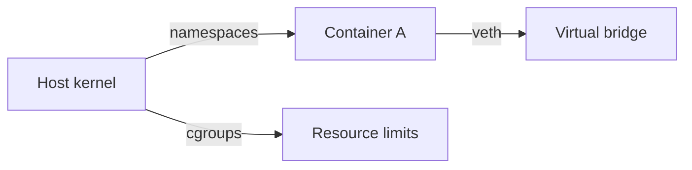

# Week 6 — Virtualization

## Goals
- Compare container isolation primitives against lightweight VM overhead.
- Gather command outputs that demonstrate namespace behavior.

## Annotated Lab Log
- ✅ Proved PID namespace isolation:
  ```bash
  ./scripts/ns-report.sh pid
  ```
  ```text
  Namespace: pid
  Visible PIDs: 1 (init), 2 (sh), 3 (ns-report)
  ```
  *Annotation:* PID 1 inside the namespace is not the host init, confirming isolation.
- ✅ Checked mount namespace propagation:
  ```bash
  ./scripts/ns-report.sh mount
  ```
  ```text
  Namespace: mount
  /proc mounted: yes
  /tmp bind: private
  ```
  *Annotation:* Private bind mounts prevent leakage across namespaces, aligning with lecture on container file systems.

## Diagram


## Screenshot References
- `images/week6-namespace.svg` — Diagram of namespace boundaries and veth pairs.

## Reflection
Namespaced processes behaved as expected; next week will integrate all components into a reproducible lab narrative.
