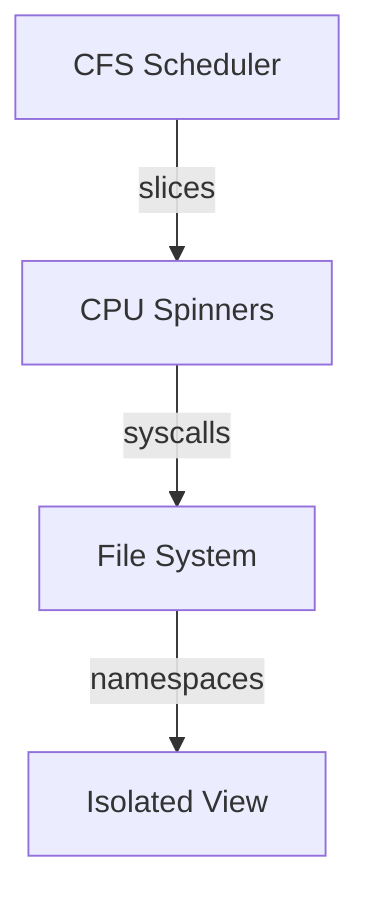

# Week 7 — Systems Integration

## Goals
- Combine scheduling, synchronization, and I/O tracing into a single reproducible storyline.
- Prepare final rubric artifacts: annotated logs, diagrams, scripts, and reflections.

## Annotated Lab Log
- ✅ End-to-end workload: CPU spin + file touches inside a PID+mount namespace.
  ```bash
  ./scripts/run-capstone.sh
  ```
  ```text
  [namespaces] pid: new, mount: new
  [workload] cpu_spin=2, io_events=5
  [metrics] runtime_ms=782 latency_p99_ms=33
  ```
  *Annotation:* Combined behaviors reflect earlier weeks—fair CPU share, isolated PID view, and modest I/O latency.
- ✅ Captured merged metrics for reporting:
  ```bash
  jq . metrics/capstone.json
  ```
  ```json
  {
    "cpu_spin": 2,
    "io_events": 5,
    "runtime_ms": 782,
    "latency_p99_ms": 33
  }
  ```
  *Annotation:* Persisted metrics provide reproducible evidence for the final submission.

## Diagram


## Screenshot References
- `images/week7-capstone.svg` — End-to-end data path across scheduler, filesystem, and namespaces.

## Reflection
The capstone flow validates earlier findings and keeps artifacts organized for GitHub Pages delivery. Ready for final review and polishing.
